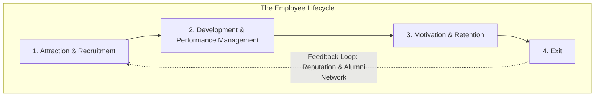

# Talent & Human Resources

## Introduction: HR as a Strategic Partner

In the landscape of modern business, the function of Human Resource (HR) Management has undergone a profound transformation. What was once viewed as a primarily administrative department—handling payroll, benefits, and compliance—is now recognized as a critical strategic partner. To understand this shift, it's useful to revisit Porter's Value Chain, which separates a firm's activities into primary and support categories.

While primary activities like Operations and Marketing are directly involved in creating and selling a product, **Human Resource Management** is a key **support activity** that enables every other function to perform at its peak. A brilliant marketing plan is worthless without the right creative talent to execute it. A cutting-edge manufacturing process is useless without skilled engineers and operators to run it.

This brings us to the central thesis of this lesson: In an economy increasingly driven by knowledge, innovation, and service, **human capital**—the collective skills, knowledge, and experience of a company's workforce—is often the most important source of a *sustained* competitive advantage. The management of this capital is not a secondary concern; it is a core strategic imperative.

## The "War for Talent": Building an Inimitable Resource

The phrase "The War for Talent" was coined in the late 1990s to describe the increasingly fierce competition companies face to attract, develop, and retain top-performing employees. This "war" is not just a passing trend; it's a permanent feature of a globalized, knowledge-based economy. Winning this war is essential because a superior workforce is one of the few truly defensible competitive advantages a firm can build.

To understand why, we can apply the **VRIO framework** from our lesson on strategy. A cohesive, highly-skilled, and motivated team can be a firm's most powerful strategic asset:

  * **Valuable**: A great team allows a firm to exploit market opportunities and neutralize threats.
  * **Rare**: Truly high-performing individuals and teams are, by definition, not commonplace.
  * **Inimitable (Hard to Imitate)**: This is the most important test. Competitors can copy your products, your pricing, and your technology. What they cannot easily replicate is your organization's unique culture and the specific, synergistic chemistry of your team, which is built over years of hiring, development, and shared experience.
  * **Organized to Capture Value**: The firm's structure, processes, and compensation systems must be aligned to leverage its talent effectively.

A company's talent strategy is therefore a direct reflection of its business strategy. The "right" people for one company may be the wrong people for another:

  * A firm pursuing a **Cost Leadership** strategy, like Walmart, needs to build a workforce that is incredibly efficient, disciplined, and focused on operational excellence to minimize Supplier Opportunity Cost (SOC).
  * A firm pursuing a **Differentiation** strategy, like Tesla, must attract and retain the most innovative engineers and designers in the world to create unique products that command a high Customer Willingness to Pay (WTP).

!!! info "Case Spotlight: AI Acquihires"

    Nowhere is the strategic importance of talent more visible than in the tech industry's practice of **"acqui-hiring,"** where a company is bought primarily for its team, not its product. This is driven by the extreme scarcity of elite AI talent, with only a few thousand people globally capable of training the most advanced AI models. A prime example is **Microsoft's $650 million deal for the AI startup Inflection**. While the deal included licensing Inflection's technology, the real prize was the team. Microsoft hired most of the staff, including co-founder Mustafa Suleyman, a leading AI researcher. The value was in acquiring a proven, cohesive team that had already built large language models competitive with the world's best. This move demonstrates the "War for Talent" in its most extreme form: the talent itself was the strategic asset, proving that in some cases, the talent strategy *is* the corporate strategy.

## The Employee Lifecycle: Executing the Strategy

Once a company understands the strategic importance of talent, its focus must shift to execution. This is accomplished by managing the **employee lifecycle**—a series of integrated stages that covers an employee's entire journey with the organization. Each stage, from attraction to retention, is a strategic lever that must be aligned with the firm's overall competitive plan.

### Attraction & Recruitment: Building the Talent Pipeline

The first step in winning the war for talent is building a robust pipeline of high-quality candidates. This requires a company to think like a marketer, but instead of selling a product to customers, it is selling a career to potential employees.

* **Employer Branding**: Every company has an **employer brand**—its reputation as a place to work. This brand is critical because the company is not just competing in its product markets; it is also competing in the **factor market for labor**. A strong employer brand, shaped by the company's culture and its actions, can significantly lower the cost of recruitment and attract higher-quality applicants.
* **Sourcing & Selection**: The goal is not just to hire people, but to hire the *right* people for the chosen strategy. A company focused on **Cost Leadership** might screen for candidates who are detail-oriented, reliable, and comfortable in a highly structured environment. In contrast, a firm focused on **Differentiation** will likely seek out creative, independent thinkers who are comfortable with ambiguity and rapid change.
* **Foundational Lens - Diversity, Equity & Inclusion (DEI)**: A modern approach to recruitment views DEI not as a matter of compliance, but as a source of competitive advantage. This perspective aligns directly with a **Stakeholder Primacy** ideology, which values the contributions of a broad set of constituents. By building a diverse workforce, a company can gain deeper insights into a wider range of customers, foster greater innovation by incorporating different viewpoints, and attract talent from a larger pool.

###  Development & Performance Management: Aligning Action with Intent

Once an employee is hired, the focus shifts to ensuring their actions are aligned with the company's strategic goals. This involves a continuous process of development and performance management.

* **Onboarding**: The onboarding process is the first, and perhaps most critical, step in embedding **organizational culture**. It is where new hires learn the "unwritten rules" and are formally socialized into "how we do things around here."

#### **The Core Managerial Choice: Outcomes vs. Process**

At the heart of performance management is a fundamental choice: do you manage people by telling them *what to achieve* (outcomes) or by telling them *how to do it* (process)? This decision is a practical application of how the firm chooses to solve the **Principal-Agent Problem**.

**Managing to Outcomes: MBO & OKRs**: A focus on outcomes empowers employees. The classic framework for this is **Management by Objectives (MBO)**, which has evolved into the more agile **Objectives and Key Results (OKRs)** system. In an OKR system, teams set ambitious, qualitative **Objectives** and define a small number of measurable, quantitative **Key Results** to track progress. This provides alignment and autonomy, as teams are free to figure out the best way to achieve their KRs.

**Implications**: This choice has cascading effects. Managing to outcomes requires **hiring** for problem-solving ability, not just obedience. It requires **compensating** for the achievement of results, and it requires **information systems** that promote transparency and progress tracking, not just top-down control.

#### **Performance Management Systems: Engineering a Culture**

The strategic choice between managing to **outcomes** versus managing to **process** is not just a high-level decision; it is made real through the design of the **performance management system**. These systems are the machinery that translates corporate strategy into individual action. They are powerful tools of cultural engineering because they send unambiguous signals about what is truly valued within the organization, shaping everything from strategic focus to the everyday interpersonal dynamics between colleagues. The specific tools a company chooses and how it implements them will determine whether it fosters a culture of intense individual achievement, deep collaboration, or daring innovation.

**The Balanced Scorecard (BSC)**

BSC is a framework designed to translate a company's strategic objectives into a set of performance metrics. Crucially, it moves beyond purely financial measures by incorporating three additional perspectives: the customer, internal business processes, and learning and growth.

**Cultural Impact 🎯:** By forcing managers to set goals and measure performance across all four areas, the BSC helps create a **customer-oriented** and strategically-aligned culture. It prevents the kind of short-term thinking that can arise from a singular focus on financial results. For example, a goal to "improve customer satisfaction by 10%" (customer perspective) might be linked to a goal to "reduce order processing time" (internal process perspective) and "train staff on new CRM software" (learning and growth perspective). This ensures that daily activities are directly tied to the broader strategic vision.

**Interpersonal Dynamics:** The BSC fosters cross-functional collaboration. The marketing team can no longer operate in a silo, as their customer satisfaction goals are now explicitly linked to the operational efficiency of the logistics team. It forces leaders from different departments to have conversations about trade-offs and shared objectives.

**360-Degree Feedback**

This tool expands the source of performance feedback beyond just an employee's direct manager. It systematically gathers confidential, and often anonymous, feedback from an employee's peers, direct reports, and even customers.

**Cultural Impact 🤝:** Implementing 360-degree feedback is a powerful way to build a **collaborative culture** that values self-awareness and interpersonal skills. It signals that how you work with your colleagues is just as important as your individual output. When done well, it breaks down hierarchical barriers and encourages individuals to take ownership of their professional development.

**Interpersonal Dynamics:** This tool can profoundly impact daily life at work. It encourages employees to be more mindful of their impact on others, as they know they will be evaluated by their peers. It can foster open communication, but if implemented poorly, it can also create an environment of political maneuvering where individuals are afraid to give honest, constructive criticism.

**Objectives and Key Results (OKRs)**

As discussed, OKRs are a tool for setting ambitious goals and tracking their outcomes. The system is defined by its transparency, where everyone in the organization can see everyone else's objectives.

**Cultural Impact 🚀:** OKRs are purpose-built to foster a **high-performance culture** focused on **innovation and exploration**. The emphasis on "stretch goals"—ambitious objectives that are designed to be only partially achieved—encourages risk-taking and pushes teams beyond their comfort zones. The transparency of the system aligns the entire organization around a shared set of priorities, creating a sense of collective mission.

**Interpersonal Dynamics:** The fast-paced, highly-visible nature of OKRs creates a very results-focused environment. Regular check-ins and the public tracking of progress create a dynamic of accountability and can be highly motivating. It focuses conversations between managers and employees on progress and problem-solving, rather than on judging past behavior.    

### Motivation & Retention: Solving the Principal-Agent Problem

The final stage of the lifecycle is focused on keeping the best people and ensuring they remain motivated. At its core, this is about solving the **Principal-Agent Problem** in the employer-employee relationship: how do you ensure that employees (agents) act in the best interest of the firm (the principal)? This is achieved through a combination of extrinsic and intrinsic rewards.

#### **Tool #1: Total Rewards & Incentives**:

* **Compensation Philosophy**: A company's approach to pay is a direct reflection of its ideology. A strict **Shareholder Primacy** view may treat wages as a cost to be minimized, while a **Stakeholder Primacy** view sees fair compensation as a critical investment in a key partner.
* **The Employee as a Residual Claimant**: As we learned, shareholders are the firm's ultimate risk-takers. A powerful way to align employee interests with owner interests is to make employees *feel* like owners. Outcome-based contracts like **stock options** and **profit-sharing plans** give employees a direct financial stake in the company's success, motivating them to think and act like residual claimants.

#### **Tool #2: Intrinsic Motivation & Culture**:

* Motivation is not just about money. A strong, positive culture fosters intrinsic motivation by providing employees with a sense of **purpose** (believing in the company's mission), **autonomy** (having control over their work), and **mastery** (getting better at what they do).
* This kind of culture acts as an "invisible control system," encouraging **discretionary effort**—when employees voluntarily go above and beyond their formal job requirements, not because they are being monitored, but because they are engaged and committed to the organization's success.

#### **Tool #3: Building Trust through Feedback and Transparency 🧠**

Beyond direct incentives and cultural norms, a powerful modern approach to motivation involves systematically shaping the work environment itself. This is achieved by creating systems that listen to employees and increase organizational transparency. The goal is to build a high-trust environment where employees feel both heard and informed, which is a cornerstone of long-term retention. This approach has two key components:

1.  **Organizational "Listening" Systems**
        A company can only fix problems it knows about. A systematic approach to gathering feedback demonstrates to employees that their voice matters, making them feel like valued partners rather than just cogs in a machine. This is put into practice through:

    * **Employee Engagement Surveys**: These are typically annual, in-depth surveys (like Gallup's Q12) that measure factors like job satisfaction, relationship with management, and belief in the company's mission.
    * **Pulse Surveys**: These are short, frequent, and often anonymous surveys that can track employee sentiment on specific issues in near real-time.
    * **Linking Data**: The most advanced companies map this employee feedback to other data points, like customer satisfaction scores or operational metrics. For example, if a company discovers that its highest-rated managers (based on employee surveys) also run the most profitable and customer-centric teams, it has a powerful, data-driven model for what good leadership looks like in their organization. The aim is to create a continuous feedback loop where the organization evaluates the efficacy of its policies and updates its management framework based on evidence, not just assumptions.

2.  **Information Systems as an Equalizer**
    Historically, the organizational hierarchy created significant **information asymmetry**, where managers knew much more than their reports. Modern information systems can radically reduce this asymmetry, creating a more equitable and motivating environment.

    * **Upward Visibility for Employees**: When a company uses transparent platforms for goal setting (like an organization-wide OKR dashboard), an employee gains unprecedented visibility. They can see their supervisor's objectives, their department's goals, and even the CEO's top priorities. This creates **shared context**, transforming an employee's work from a series of disconnected tasks into a meaningful contribution to a larger, visible mission.
    * **Improved Visibility for Supervisors**: These systems also give supervisors better insight into their team's work products and progress, often through shared project management tools (like Asana or Jira). When a manager can see real-time progress, it reduces the need for status-update meetings and micromanagement. This increased trust fosters greater autonomy for the employee, which is a powerful intrinsic motivator.

Together, these systems create a virtuous cycle. By actively listening, the organization shows it trusts and values its employees' input. By increasing transparency, it demonstrates that it trusts employees with important information, empowering them to make better, more autonomous decisions.

### **The Exit Stage: Managing a Graceful Transition**

The employee lifecycle does not end with retention; it concludes with the employee's exit. While departures are inevitable, they should not be treated as failures or mere administrative clean-up. A well-managed exit process is a strategic activity that protects the organization's resources, gathers vital intelligence, and preserves its long-term reputation.

* **Protecting the Employer Brand and Recruitment Pipeline**
    An employee's final experience with a company can disproportionately shape their lasting opinion of it. Ex-employees become powerful **brand ambassadors**, for better or for worse. In an era of transparency, where platforms like Glassdoor and professional networks like LinkedIn give everyone a public voice, the stories told by former employees directly impact a company's **employer brand**. A positive reputation in the **factor market for labor** makes it easier and cheaper to attract top talent. Conversely, a string of poorly handled exits can poison the recruitment pipeline, significantly increasing the cost and difficulty of winning the "War for Talent."

* **The Exit Interview: A Source of Candid Feedback**
    The exit interview is one of the most valuable "listening" tools an organization has. A departing employee, having already made the decision to leave, is often in a unique position to provide candid feedback about the company's culture, management, and processes without fear of reprisal. This is a critical opportunity for organizational learning. By systematically analyzing exit interview data, HR and leadership can identify hidden problems—like a toxic manager, a flawed process, or a non-competitive compensation structure—that employee engagement surveys might not fully reveal.

* **Operational and Knowledge Security**
    A structured off-boarding process is essential for business continuity and protecting a firm's competitive advantage.
    * **Operational Security:** This involves the practical steps of revoking access to systems, recovering company assets (like laptops and badges), and ensuring a smooth handover of responsibilities. A failure in this process can create significant security vulnerabilities.
    * **Knowledge Transfer:** More strategically, the exit process is a critical moment for knowledge management. When a veteran employee leaves, they take a vast amount of tacit knowledge—the "unwritten rules" and deep experience—with them. A good off-boarding process includes a plan to transfer this critical knowledge to remaining team members, thereby protecting the **inimitable** capabilities that form the basis of the firm's **VRIO** advantage.

* **From Ex-Employee to Alumnus: Building a Long-Term Asset**
    Forward-thinking companies now view departing employees not as a loss, but as graduates joining a corporate **alumni network**. By maintaining a positive relationship, companies can turn ex-employees into a valuable long-term asset. These alumni can become sources of customer referrals, future business partnerships, and, most importantly, a "boomerang" talent pool of experienced individuals who may choose to return to the company later in their careers with new skills and perspectives.
