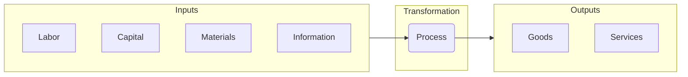
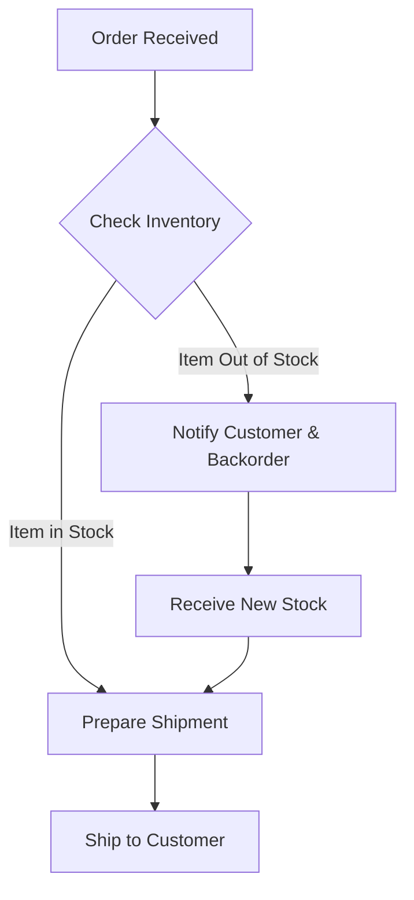

# Operations Management 
**The Engine of Value Creation**

## Introduction: What is Operations Management?

If strategy is the plan and the organization is the architecture, then **Operations Management (OM)** is the engine that drives the business forward. It is the business function responsible for managing the processes that transform inputs, such as raw materials and labor, into outputs in the form of finished goods and services.

At its core, OM is built on a simple but powerful framework: the **Input-Process-Output model**.

  * **Inputs:** The resources a company uses, which it procures from various **factor markets**. This includes labor, capital, materials, and information.
  * **Process:** The series of actions and activities that transform the inputs. This could be anything from assembling a car to writing code for a software application.
  * **Outputs:** The final goods or services that are sold to customers in the **product market**.

Operations Management is where "the rubber meets the road." It is the function that directly executes the company's strategy to create value. By designing and managing efficient and effective processes, OM has a direct impact on a company's **Supplier Opportunity Cost (SOC)**, a critical component of the value creation formula we learned in our first lesson.

## **The Core Trade-Offs: Linking Operations to Strategy**

Every company is a collection of activities performed to design, produce, market, deliver, and support its product. To understand how operations connects to strategy, it’s useful to visualize these activities using **Porter's Value Chain**. This model shows how a firm's activities work together to create value for its customers.

The value chain separates a firm's activities into two categories: **primary** and **support**.

**Primary Activities** are directly involved in the physical creation and distribution of the product. They include:  

  * **Inbound Logistics:** Receiving and storing raw materials.  
  * **Operations:** Transforming inputs into the final product.  
  * **Outbound Logistics:** Collecting, storing, and distributing the product to buyers.  
  * **Service:** Providing support after the sale.  

**Support Activities** provide the infrastructure that allows the primary activities to take place. They include Firm Infrastructure, Human Resource Management, Technology Development, and Procurement.

The entire purpose of analyzing this chain is to find ways to create a **competitive advantage**. A firm can achieve this by either performing these activities at a lower cost than rivals (**cost leadership**) or performing them in a unique way that creates more value for customers (**differentiation**).

### **The Fundamental Operations Trade-Off**

This brings us to a fundamental trade-off at the heart of Operations Management: the tension between **efficiency** and **flexibility**.

* **Efficiency (Cost):** An operation focused on efficiency aims to produce goods or services at the lowest possible cost. This is achieved through standardization, high volume, and repetitive processes. A **cost leadership** strategy, like Walmart's, demands that every activity in the value chain—especially logistics and operations—be relentlessly optimized for efficiency.  
* **Flexibility (Responsiveness):** An operation focused on flexibility can quickly adapt to changes in customer needs, product design, or volume. This often requires more skilled labor and less specialized equipment, which increases costs. A **differentiation** strategy, like that of a custom furniture maker, requires operational flexibility to create the unique value that customers are willing to pay more for.

A company's strategic choice determines where it needs to be on this spectrum. The operational decisions about what processes and resources to use are a direct translation of the firm's overall plan for how it will win in the marketplace.

##  **Designing the Engine: Process Management & Analysis**

At the heart of operations is the **process**: a series of actions or steps that transform inputs into outputs. Nearly everything a business does can be described as a process, from manufacturing a product to onboarding a new employee or handling a customer service request. **Process management** is the art and science of designing, analyzing, and improving these processes to make them more efficient and effective.

### Making Work Visible: The Power of Process Mapping

To improve a process, you must first understand it. **Process mapping** is the critical tool used to create a visual diagram of the steps in a process. However, a process map is much more than a simple flowchart; it is a dynamic tool for strategy, daily management, and cultural change. The nature of the map depends on the "flow-logic" of the work, whether it's tracking the **flow of materials** in a factory, the **flow of people** in a hospital, the **flow of inventory** in a warehouse, or the **flow of digital information** in an insurance company.

A simple map for a customer order might look like this:

By making the invisible work visible, this map becomes a powerful tool for management at every level.

#### A Strategic Tool for Leadership

For a senior leader like a Chief Operating Officer (COO), a process map is a strategic dashboard. It reveals the **"levers and dials"** they can adjust to implement the company's high-level strategy.

  * By analyzing the map, leaders can identify opportunities to cut waste and increase efficiency to support a **cost leadership** strategy.
  * Alternatively, they can find places to add features or customization to support a **value differentiation** strategy.
  * It is also essential for **adapting to the external environment**. A process map shows exactly how a new technology or a shift in customer needs will impact the company's internal engine, allowing leaders to plan a proactive response.

#### A Tactical Tool for Daily Management

Process maps are not just for high-level planning; they are living documents used for day-to-day operational control.

  * **Monitoring & Control:** Maps provide a baseline for performance, allowing managers to monitor key metrics and ensure the process is running as designed.
  * **Troubleshooting:** When a problem occurs, the map is the first place a team looks to triage the issue and identify the root cause.
  * **Resource Allocation:** A clear map helps managers allocate people and resources effectively to where they are needed most, especially to resolve bottlenecks.

#### A Cultural Tool for Empowerment

Perhaps most powerfully, a shared understanding of process maps is a prerequisite for building a culture of empowerment and decentralized decision-making.

  * When employees closest to the work have a clear, shared map of the entire process, they are empowered to make decisions and suggest improvements without constant supervision.
  * This fosters **bottom-up communication**, as frontline workers can use the map to show managers exactly where a problem is occurring or how a process could be improved. This creates a culture of continuous improvement and employee ownership.

### **Key Concepts for Process Analysis**

Once a process is mapped, managers use key concepts to analyze its performance. Two of the most important are **bottlenecks** and **throughput**.

* **Bottlenecks 🍾:** A **bottleneck** is the step in a process that has the lowest capacity, effectively acting as a ceiling for the entire system's output. Think of a five-lane highway that merges down to a single lane for a toll booth; the toll booth is the bottleneck that determines how many cars can pass through per hour.  Identifying the bottleneck is often the first step to improving overall performance.

* **Throughput:** This is the rate at which a process produces output (e.g., units per hour, customers served per day). The **throughput** of any process is ultimately determined by the capacity of its bottleneck.

#### **Managing Flow: Iteration and Stability**

Identifying a bottleneck is just the beginning. The real work of operations management lies in the **constant iteration** of processes to address these bottlenecks and improve overall throughput. This continuous improvement is critical for effective **production and capacity planning**, allowing a business to reliably forecast and meet customer demand.

However, this creates a crucial managerial tension. While iteration is essential for improvement, there must be a balance between the **pace of iteration and operational stability**. Changing a process too frequently can introduce errors, confuse employees, and disrupt the workflow, ultimately harming efficiency and output quality.

Therefore, effective process improvement is not about random change but about **controlled experimentation**. This is the heart of process innovation and change management. By making targeted changes and carefully measuring their impact—much like the Plan-Do-Check-Act cycle—managers can learn, adapt, and improve processes without sacrificing the stability needed to run the business day-to-day.