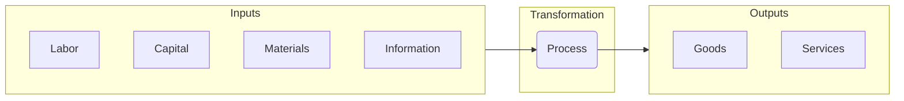
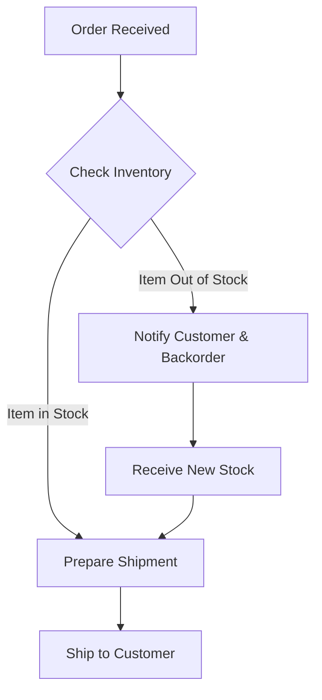
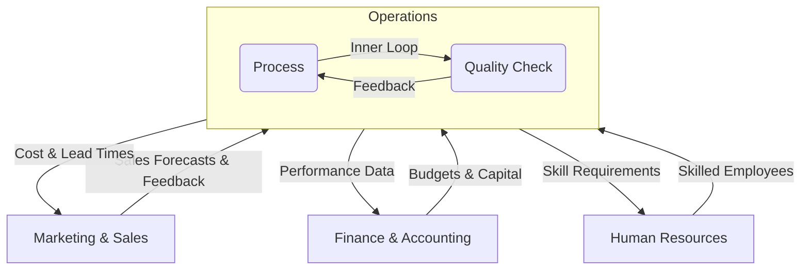

# Operations Management 
**The Engine of Value Creation**

## Introduction: What is Operations Management?

If strategy is the plan and the organization is the architecture, then **Operations Management (OM)** is the engine that drives the business forward. It is the business function responsible for managing the processes that transform inputs, such as raw materials and labor, into outputs in the form of finished goods and services.

At its core, OM is built on a simple but powerful framework: the **Input-Process-Output model**.

  * **Inputs:** The resources a company uses, which it procures from various **factor markets**. This includes labor, capital, materials, and information.
  * **Process:** The series of actions and activities that transform the inputs. This could be anything from assembling a car to writing code for a software application.
  * **Outputs:** The final goods or services that are sold to customers in the **product market**.

Operations Management is where "the rubber meets the road." It is the function that directly executes the company's strategy to create value. By designing and managing its processes, OM has a direct impact on a company's Supplier Opportunity Cost (SOC) by driving efficiency, and can also boost Customer Willingness to Pay (WTP) by improving product quality and responsiveness.

## **The Core Trade-Offs: Linking Operations to Strategy**

Every company is a collection of activities performed to design, produce, market, deliver, and support its product. To understand how operations connects to strategy, it’s useful to visualize these activities using **Porter's Value Chain**. This model shows how a firm's activities work together to create value for its customers.

The value chain separates a firm's activities into two categories: **primary** and **support**.

**Primary Activities** are directly involved in the physical creation and distribution of the product. They include:  

  * **Inbound Logistics:** Receiving and storing raw materials.  
  * **Operations:** Transforming inputs into the final product.  
  * **Outbound Logistics:** Collecting, storing, and distributing the product to buyers.  
  * **Service:** Providing support after the sale.  

**Support Activities** provide the infrastructure that allows the primary activities to take place. They include Firm Infrastructure, Human Resource Management, Technology Development, and Procurement.

The entire purpose of analyzing this chain is to find ways to create a **competitive advantage**. A firm can achieve this by either performing these activities at a lower cost than rivals (**cost leadership**) or performing them in a unique way that creates more value for customers (**differentiation**).

### **The Fundamental Operations Trade-Off**

This brings us to a fundamental trade-off at the heart of Operations Management: the tension between **efficiency** and **flexibility**.

* **Efficiency (Cost):** An operation focused on efficiency aims to produce goods or services at the lowest possible cost. This is achieved through standardization, high volume, and repetitive processes. A **cost leadership** strategy, like Walmart's, demands that every activity in the value chain—especially logistics and operations—be relentlessly optimized for efficiency.  
* **Flexibility (Responsiveness):** An operation focused on flexibility can quickly adapt to changes in customer needs, product design, or volume. This often requires more skilled labor and less specialized equipment, which increases costs. A **differentiation** strategy, like that of a custom furniture maker, requires operational flexibility to create the unique value that customers are willing to pay more for.

A company's strategic choice determines where it needs to be on this spectrum. The operational decisions about what processes and resources to use are a direct translation of the firm's overall plan for how it will win in the marketplace.

##  **Designing the Engine: Process Management & Analysis**

At the heart of operations is the **process**: a series of actions or steps that transform inputs into outputs. Nearly everything a business does can be described as a process, from manufacturing a product to onboarding a new employee or handling a customer service request. **Process management** is the art and science of designing, analyzing, and improving these processes to make them more efficient and effective.

### Making Work Visible: The Power of Process Mapping

To improve a process, you must first understand it. **Process mapping** is the critical tool used to create a visual diagram of the steps in a process. However, a process map is much more than a simple flowchart; it is a dynamic tool for strategy, daily management, and cultural change. The nature of the map depends on the "flow-logic" of the work, whether it's tracking the **flow of materials** in a factory, the **flow of people** in a hospital, the **flow of inventory** in a warehouse, or the **flow of digital information** in an insurance company.

A simple map for a customer order might look like this:

By making the invisible work visible, this map becomes a powerful tool for management at every level.

#### A Strategic Tool for Leadership

For a senior leader like a Chief Operating Officer (COO), a process map is a strategic dashboard. It reveals the **"levers and dials"** they can adjust to implement the company's high-level strategy.

  * By analyzing the map, leaders can identify opportunities to cut waste and increase efficiency to support a **cost leadership** strategy.
  * Alternatively, they can find places to add features or customization to support a **value differentiation** strategy.
  * It is also essential for **adapting to the external environment**. A process map shows exactly how a new technology or a shift in customer needs will impact the company's internal engine, allowing leaders to plan a proactive response.

#### A Tactical Tool for Daily Management

Process maps are not just for high-level planning; they are living documents used for day-to-day operational control.

  * **Monitoring & Control:** Maps provide a baseline for performance, allowing managers to monitor key metrics and ensure the process is running as designed.
  * **Troubleshooting:** When a problem occurs, the map is the first place a team looks to triage the issue and identify the root cause.
  * **Resource Allocation:** A clear map helps managers allocate people and resources effectively to where they are needed most, especially to resolve bottlenecks.

#### A Cultural Tool for Empowerment

Perhaps most powerfully, a shared understanding of process maps is a prerequisite for building a culture of empowerment and decentralized decision-making.

  * When employees closest to the work have a clear, shared map of the entire process, they are empowered to make decisions and suggest improvements without constant supervision.
  * This fosters **bottom-up communication**, as frontline workers can use the map to show managers exactly where a problem is occurring or how a process could be improved. This creates a culture of continuous improvement and employee ownership.

### **Key Concepts for Process Analysis**

Once a process is mapped, managers use key concepts to analyze its performance. Two of the most important are **bottlenecks** and **throughput**.

* **Bottlenecks 🍾:** A **bottleneck** is the step in a process that has the lowest capacity, effectively acting as a ceiling for the entire system's output. Think of a five-lane highway that merges down to a single lane for a toll booth. Alternatively, a bottleneck could be a single, highly-skilled quality assurance expert whose slow, careful review process limits the rate of approved products. Identifying the bottleneck is often the first step to improving overall performance.

* **Throughput:** This is the rate at which a process produces output (e.g., units per hour, complex customer problems solved per week, or new software features that pass quality checks per month). The throughput of any process is ultimately determined by the capacity of its bottleneck.

#### **Managing Flow: Iteration and Stability**

Identifying a bottleneck is just the beginning. The real work of operations management lies in the **constant iteration** of processes to address these bottlenecks and improve overall throughput. This continuous improvement is critical for effective **production and capacity planning**, allowing a business to reliably forecast and meet customer demand.

However, this creates a crucial managerial tension. While iteration is essential for improvement, there must be a balance between the **pace of iteration and operational stability**. Changing a process too frequently can introduce errors, confuse employees, and disrupt the workflow, ultimately harming efficiency and output quality.

Therefore, effective process improvement is not about random change but about **controlled experimentation**. This is the heart of process innovation and change management. By making targeted changes and carefully measuring their impact—much like the Plan-Do-Check-Act cycle—managers can learn, adapt, and improve processes without sacrificing the stability needed to run the business day-to-day.

## **Fueling the Engine: The Supply Chain**

A company’s operations don't exist in a vacuum; they are fueled by a constant flow of materials, information, and funds from a network of external partners. The entire system—from the raw material supplier to the end customer—is known as the **supply chain**.

At the heart of managing this network lies a fundamental strategic question: **what should our firm do itself, and what should it buy from others?** This is a question about the firm's **organizational boundary**—the line separating internal activities from those sourced externally. **Supply Chain Management (SCM)** is the active management of this boundary and the entire network of partners to maximize customer value and achieve a sustainable competitive advantage.

### **The Core Activities of SCM**

Executing a supply chain strategy involves orchestrating three interconnected activities:

* **Sourcing and Procurement**: This is the process of finding, evaluating, and engaging suppliers to purchase the inputs—raw materials, components, or services—needed for production. This function is a direct counterpart to the "Procurement" support activity in Porter's Value Chain.
* **Logistics**: This involves managing the physical movement and storage of goods. It includes **inbound logistics** (managing the flow from suppliers into the company's facilities) and **outbound logistics** (managing the flow of finished products to the end customer).
* **Inventory Management**: This is the art and science of controlling the ordering, storage, and use of a company's inventory. It involves navigating a critical trade-off: holding too much inventory ties up cash and incurs storage costs, while holding too little risks stockouts and lost sales. 💰

### **The Strategic Importance of the Supply Chain**

Effective SCM is far more than a cost-saving exercise; it is a powerful engine for competitive advantage. The decisions made here directly shape a company's ability to compete.

* **Supporting Cost Leadership**: For companies like **Amazon** or **Walmart**, a hyper-efficient, low-cost supply chain is the cornerstone of their business model. By optimizing every step of procurement and logistics, they can drive down operational costs and pass those savings on to customers.
* **Enabling Differentiation**: A supply chain can also be a key enabler of a differentiation strategy. **Zara**, which competes on "fast fashion," relies on an incredibly agile and responsive supply chain to move designs from the runway to stores in weeks. Similarly, a business promising ethically sourced coffee needs a transparent and traceable supply chain to validate its brand promise.
* **Building Resilience**: In an increasingly volatile world, a critical goal of SCM is building **resilience**—the ability to anticipate, withstand, and recover from disruptions, whether from natural disasters, geopolitical events, or pandemics. A cheap supply chain is worthless if it breaks at the first sign of trouble.

### **Sourcing Strategies: Drawing the Organizational Boundary**

The "make vs. buy" decision is where strategy meets action, defining the firm's operational footprint.

* **Insourcing (Make)**: Performing an activity internally. A company might insource critical activities to maintain tight control over quality, protect proprietary technology, or leverage a unique internal capability.
* **Outsourcing (Buy)**: Procuring a product or service from an external supplier. Companies often outsource non-core activities (like payroll or IT support) to focus on their core competencies, reduce costs, or access specialized skills.
* **Strategic Partnerships**: Forming a close, long-term relationship with a key supplier. This is common for complex, custom-developed components where the firm and its supplier must collaborate deeply on design and innovation.

This is not a one-time choice. The "right" strategy is dynamic; a company might shift from insourcing to outsourcing a component as its underlying technology matures and becomes a commodity.

### **Enabling Flexibility with Organizational Modularity**

How can a company flexibly manage its organizational boundary without redesigning its entire operation? The answer lies in **organizational modularity**—designing products and processes as a set of distinct, "swappable" modules. 🧩

For example, a car manufacturer might design a vehicle so that the engine, transmission, and infotainment system are all independent modules. This design provides incredible strategic flexibility. The company can:

1.  **Insource** the engine (its core competency).
2.  **Outsource** the infotainment system to a specialized electronics supplier.
3.  **Swap** that supplier for a better one later with minimal disruption to the rest of the production process.

This modular approach is the key to creating an agile supply chain that can adapt to new technologies and market opportunities.

### **Supply Chain Risk: The External Bottleneck**

Modularity and outsourcing, however, introduce a critical vulnerability: **external bottlenecks**. When a company relies on a single supplier for a crucial module or raw material, that supplier can become a single point of failure. If they cannot deliver—due to financial trouble, a factory fire, or a geopolitical conflict—the company's entire production process can grind to a halt.

Therefore, modern supply chain management has evolved. It is no longer just a quest for the lowest cost but a sophisticated balancing act: **proactively managing a network of partners to build a system that is not only efficient and cost-effective but also resilient and reliable.**

##  **Tuning the Engine: The Inner Loop of Quality Management**

A well-designed operational engine must produce a high-quality output. In a business context, **quality** means consistently **meeting or exceeding customer expectations**. The methodologies used to achieve this function as an **"Inner Loop"**—an internal feedback system designed to constantly tune and improve the company's own processes.

Two of the most influential philosophies in this inner loop are Lean and Six Sigma.

### Lean Operations

Pioneered by Toyota, **Lean Operations** is a philosophy focused on the relentless elimination of **"waste,"** defined as any activity that consumes resources but does not add value for the end customer. 

Common examples of waste include:

- Defects: Products or services that are incorrect or require rework.
- Overproduction: Making more of something than is currently needed.
- Waiting: Idle time in a process where no value is being added.
- Unnecessary Motion: Wasted movement by people or machines.

By systematically identifying and removing waste (like defects, overproduction, or waiting time), a lean operation can deliver value more quickly and at a lower cost.

### Six Sigma

While Lean is focused on flow and waste, **Six Sigma** is a highly disciplined, data-driven methodology for eliminating **defects** and reducing **process variation**. The name "Six Sigma" refers to a statistical target of achieving a quality level that is near perfection—specifically, less than 3.4 defects per million opportunities. The core idea is to use statistical analysis to identify the root causes of errors and eliminate them, resulting in products and services that are incredibly consistent and reliable.

### The Dual Impact of Quality on Value

This inner loop of quality management is a powerful driver of competitive advantage because it impacts both sides of the value creation equation:

  * **It Lowers Costs (SOC):** Higher quality means less waste and rework, which directly reduces the **Supplier Opportunity Cost (SOC)**.
  * **It Increases Value (WTP):** A reputation for high quality and reliability builds brand trust, which increases the **Customer Willingness to Pay (WTP)**.

## **The Outer Loop and the Integrated Business**

For an organization to succeed, its finely tuned operational engine must be perfectly synchronized with the rest of the business. This happens through the **"Outer Loop"**: a constant, bi-directional flow of information and coordination between Operations and other core functions like Marketing, Finance, and HR.

  * **Operations and Marketing:** Marketing provides sales forecasts that determine production volumes and customer feedback that guides quality improvements. In return, OM provides data on costs and lead times that shape pricing strategy and marketing promises.
  * **Operations and Finance:** Finance provides the capital budgets needed to invest in new equipment or process improvements. In return, OM's efficiency gains directly impact the company's profitability and financial health.
  * **Operations and Human Resources:** HR hires and trains the skilled employees needed to run the operational processes. In return, OM's adoption of new technologies dictates the future skills HR must recruit and develop.

This is where all of our previous concepts converge. The company's **strategic planning system** provides the formal venues (like QBRs) for this outer loop to function. The **organizational structure** determines how easily information flows between these functions. Ultimately, the goal of this integrated system is to align all parts of the business to flawlessly execute its **corporate strategy**.

## **Conclusion: From Engine to Enterprise**

Throughout this lesson, we have explored Operations Management not as an isolated function, but as the very engine of value creation where a company's strategic plans are forged into reality.

We've seen how strategic choices between cost and flexibility shape the design of this engine. We delved into its specific gears—the **processes** we map and improve, the **supply chains** that fuel it, and the **quality systems** that tune it for peak performance.

The central takeaway is that operational excellence is about building a cohesive and integrated system. A brilliant process is useless if the supply chain is unreliable. A high-quality product cannot succeed without market insights from sales. A cost-saving innovation has no impact if finance doesn't understand its effect on the bottom line.

Thinking like a manager, regardless of your future role, means understanding this engine. Whether you work in marketing, finance, or human resources, your decisions will both influence and be influenced by your company's operational capabilities. Mastering the principles of operations is therefore not just a task for specialists; it is a critical competency for any leader aiming to build a successful and sustainable enterprise.