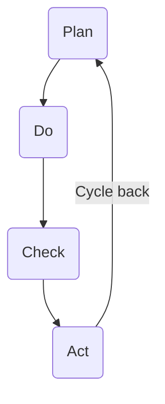

# Organization & Culture
**The Internal Architecture of the Firm**

## Introduction: The Bridge from Strategy to Structure

In our previous lessons, we've established that a company’s **strategy** is its continuous process of making choices to create and capture value. A brilliant strategy, however, is worthless if it remains a document on a shelf. It requires an organization capable of bringing it to life. This lesson explores the internal architecture of the firm—the formal structures and informal culture that enable it to execute its strategy and navigate a complex world.

A company's design should be a deliberate choice to support its competitive advantage. The classic view, famously articulated by historian Alfred Chandler, is that **"Structure Follows Strategy"**. The logic is straightforward: managers first decide on a strategy—such as becoming the lowest-cost producer or offering a unique, high-quality product—and then design the organizational structure best suited to execute it. For example, a strategy focused on cost leadership will likely lead to a structure that prioritizes efficiency and centralized control.

However, it is more accurate to say that **strategy and structure co-evolve**. The relationship is a two-way street. A company's existing structure can create inertia, making it difficult to pursue certain strategies. Yet, that same structure can also enable new, unplanned strategies to bubble up from within the organization, a phenomenon we previously called **emergent strategy**. The key takeaway is that strategy and structure are two intertwined levers that must be constantly aligned for a business to succeed.

## **The Blueprint: Formal Organizational Structures**

Just as an architect creates a blueprint before construction begins, leaders design an organizational structure to arrange the formal relationships and responsibilities within the firm. This "blueprint" dictates how information flows, where decisions are made, and how work is coordinated. The design isn't random; it's a series of trade-offs, primarily revolving around one key question: should decision-making power be concentrated at the top or distributed throughout the organization?

### **Centralization vs. Decentralization**

This is the fundamental choice in organizational design.

* **Centralization** is a structure where decision-making authority is concentrated in top management. This approach promotes efficiency, consistency, and tight control, making it well-suited for stable environments where the strategic direction is clear.  
* **Decentralization** is a structure where decision-making authority is pushed down to lower-level managers who are closer to the action. This fosters flexibility, rapid response to market changes, and empowers employees.

Most organizational structures are an attempt to balance these two poles. Let's explore the most common blueprints.

### **Functional Structure**

The **functional structure** is the most traditional blueprint, organizing the company by departments based on business functions like Marketing, Finance, Operations, and Human Resources. A CEO or central leadership team coordinates the activities of these specialized departments.

* **Best For:** Companies with a relatively narrow product scope or those operating in stable environments.  
* **Strategic Alignment:** This centralized structure is highly effective for executing a **cost leadership** strategy. By grouping specialists together, it promotes deep expertise and operational efficiency within each function, helping to drive down costs.

### **Multidivisional (SBU) Structure**

As companies grow and diversify into different products or geographic markets, the functional structure becomes unwieldy. The solution is often a **multidivisional structure**, where the firm is organized into semi-autonomous divisions, often called **Strategic Business Units (SBUs)**. Each SBU operates like its own smaller company, with its own functional departments and a leader responsible for its profitability.

* **Best For:** Large, diversified corporations that compete in multiple, distinct markets.  
* **Strategic Alignment:** This decentralized approach allows each SBU to act quickly and tailor its business-level strategy to its unique competitive environment. The corporate headquarters focuses on corporate-level strategy, such as allocating capital across the divisions and managing the overall portfolio of businesses.

### **Matrix Structure**

A **matrix structure** is a more complex, hybrid model that attempts to combine the benefits of both the functional and divisional structures. In a matrix, employees report to two managers: a functional manager (e.g., the Head of Engineering) and a project or product manager (e.g., the "New Product X" Lead).

* **Best For:** Companies in fast-paced industries like technology or consulting, where cross-functional collaboration and flexibility are critical.  
* **Benefits & Challenges:** The matrix fosters incredible knowledge sharing and allows for the flexible deployment of talent to critical projects. However, it can lead to confusion, power struggles, and conflicting priorities if not managed carefully, as employees must navigate the demands of two bosses.

### **Line-and-Staff Organization**

A **line-and-staff organization** is a structure that incorporates both a direct chain of command (**line functions**) and specialized advisory roles (**staff functions**). It's designed to combine the clear authority of a simple hierarchy with the expert knowledge required in a modern business.

**Differentiating the Roles**

The core of this model is the distinction between two types of departments or positions:

* **Line Functions ⛓️:** These are the "doers." They are directly involved in the primary mission and value-creating activities of the organization, such as production, operations, and sales. Line managers have **direct authority** and are part of the formal chain of command, making key decisions and taking responsibility for the outcomes.

* **Staff Functions 🧠:** These are the "advisors." They provide specialized, technical, and administrative support to the line functions. Examples include Human Resources (HR), Legal, Accounting, and Information Technology (IT). Staff personnel have **indirect, advisory authority**; they make recommendations and provide guidance but do not typically have the power to command line employees.

#### **Purpose and Rationale**

The goal of a line-and-staff structure is to get the best of both worlds. A simple **line organization** (with only a direct chain of command) can be fast and decisive but lacks specialized expertise. By adding staff functions, the organization gains several advantages:

* **Expert Knowledge:** Line managers can make better-informed decisions by consulting with specialists in areas like law, finance, and human resources.
* **Increased Focus:** It frees up line managers to concentrate on achieving the company's core operational goals without needing to be experts in every field.
* **Improved Planning:** Staff functions can handle detailed analysis and long-range planning, providing valuable strategic support.

A classic example is the military, where combat commanders (**line**) are supported by specialists in intelligence, logistics, and communications (**staff**). The commanders make the final decisions, but they rely heavily on the expert advice from their staff.

#### **Relationship to Other Structures**

It's important to note that "line and staff" is not a mutually exclusive structure to the ones we've discussed, like the **Functional** or **Multidivisional (SBU)** models. Rather, it's a concept that describes the roles *within* those structures. For example, within a functional organization, the Operations and Marketing departments are **line functions**, while the HR and Legal departments are **staff functions**. Similarly, a large SBU will have its own internal line managers, who may be supported by staff experts at the corporate headquarters.

!!! info "Line and Staff in Practice"

    The **line-and-staff** model isn't just a theoretical blueprint; it's a practical way to structure leadership in any complex organization. It allows a chief executive to maintain a clear chain of command while benefiting from deep expertise. You can see this structure clearly in both corporate and government settings.

    !!! quote "In the CEO's Office"

    A corporate CEO must make decisions that require both deep operational knowledge and specialized technical advice.

    * **Line Managers ⛓️:** These are the executives who run the core business, such as the heads of major divisions (e.g., President of North America) or key functions (e.g., VP of Operations). They have direct **Profit & Loss (P&L)** responsibility and are accountable for delivering business results.

    * **Staff Experts 🧠:** These are specialists who advise the CEO. This includes the **General Counsel** (the top lawyer), the **VP of Strategy**, and the **Head of Corporate Communications**. They don't run the business units, but they provide critical legal, strategic, and messaging advice to ensure the CEO and line managers make sound decisions.

    --- 

    !!! quote "In the White House"

    The Executive Branch of the U.S. government offers a classic example of a line-and-staff organization.

    * **Line Officers ⛓️:** The President's **Cabinet Secretaries** (e.g., the Secretary of Defense, Secretary of State, and Attorney General) function as line officers. They lead the major executive departments, command thousands of employees, and have the direct authority to implement and enforce laws and policy.

    * **Staff Advisors 🧠:** The **Executive Office of the President** is a vast staff organization. Roles like the **White House Chief of Staff**, the **National Security Advisor**, and the **Director of the National Economic Council** exist to provide information, analysis, and policy advice directly to the President. They don't command armies or run departments; their primary function is to help the President make the best possible decisions, which the line officers then carry out.

    ---

## **Conway's Law: The Accidental Blueprint**

While we've discussed structure as a deliberate strategic choice, it's often shaped by less rational forces. In 1968, computer scientist Melvin Conway observed that **"organizations which design systems ... are constrained to produce designs which are copies of the communication structures of these organizations."** This is known as **Conway's Law**.

The implication is profound: a company's software, products, and even its strategy, will often mirror the way its teams are structured and communicate. If the marketing and engineering departments don't talk to each other, the company will likely build products that are technologically sophisticated but fail to meet customer needs. This raises a critical question for any manager: Is your organizational structure an optimal tool for executing your strategy, or is it an accident of history that is now constraining your future?

## The Nervous System: Strategic Planning & Decision Making

An organizational structure is static in a short term; it's the flow of ideas and decisions that brings it to life. A company's high-level strategy must be translated into concrete actions, and this is achieved through its **strategic planning system**. This system is not just a set of documents, but a series of recurring "ceremonies" or rituals that set the rhythm for the entire organization.

### The Rhythm of Strategy: Planning Systems in Practice

The strategic planning system is the primary context where the CEO's vision interacts with the rest of the firm. It is the formal process designed to cascade strategy down through the ranks, allocate scarce resources like money and talent, and align everyone's attention on a shared set of priorities. This system typically follows an annual cycle:

  * **Annual Strategic Off-site:** Top leadership gathers to debate the future. They analyze the competitive landscape, review performance, and make high-level choices about the company's direction for the next 1-3 years.
  * **The Budgeting Process:** This is where strategy meets reality. The high-level plan is translated into a detailed budget. Divisions and departments pitch their projects and argue for resources. This is often an intense, political process where critical decisions about which initiatives get funded—and which do not—are made.
  * **Quarterly Business Reviews (QBRs):** Leadership teams meet regularly to review progress against the annual plan. These ceremonies are designed to check performance, identify roadblocks, and make course corrections.
  * **All-Hands Meetings:** The CEO and other leaders use these forums to communicate the strategy to all employees, celebrate wins, and ensure everyone understands how their work contributes to the company's broader goals.

The *official* purpose of these rituals is to ensure that decision-making is rational and aligned. They create the formal arena for the models we will discuss next. However, as we will see, the reality within this arena is often far more complex than the formal process suggests.

### The Rational Model: Plan-Do-Check-Act

The idealized logic behind these corporate ceremonies is the rational model. A classic example is the **Plan-Do-Check-Act (PDCA)** cycle, a framework for continuous improvement.

  * **Plan:** Identify a goal or problem and develop a plan to address it.
  * **Do:** Implement the plan.
  * **Check:** Analyze the results.
  * **Act:** If successful, scale the initiative. If not, begin the cycle again.

This structured approach represents the *theory* of how the strategic planning system should work to implement the **intended strategy**. It is most effective in stable environments where cause-and-effect is clear.

### The Adaptive Model: Agile Frameworks

What happens when the environment is not stable, but is instead marked by deep uncertainty? In response, many companies have adopted **agile frameworks**. Originally developed for software development, the agile mindset is a system designed for a world where we must "sense and respond" rather than just "plan and execute."

Instead of creating a detailed, long-term plan, agile teams work in short, iterative cycles. They build a small piece of a product, get feedback from the real world, and then adapt their plan for the next cycle. This approach embraces uncertainty and is built to learn and pivot quickly.

### The "Organized Anarchy" Model: The Garbage Can

While the PDCA cycle describes the *idealized logic* of the strategic planning system, a third model describes what often *actually happens* within those formal budget meetings and quarterly reviews. The **Garbage Can Model of Organizational Choice** proposes that these corporate ceremonies often function less like a rational debate and more like an "organized anarchy".

The model suggests that decisions are often the result of a semi-random collision of four independent "streams" flowing through the organization:

1.  **Problems:** These are the issues demanding attention. Crucially, a "problem" isn't just a negative issue like falling profits. It can be a **positive crisis**, such as **explosive, unexpected demand for a product**, which creates immense pressure on the company's production, logistics, and finance functions. Such a situation is not a time for management to relax; it requires an intense, strategic response.

2.  **Solutions:** These are the answers looking for a question. A "solution" could be an employee's pet project, a new technology a department wants to buy, or a potential acquisition someone is championing.

3.  **Participants:** These are the employees who show up to the meetings. Their personal motivations, expertise, and available energy influence what gets discussed and decided.

4.  **Choice Opportunities:** These are the formal "garbage cans" where the streams can mix. They are the very ceremonies we discussed earlier: the **annual budgeting process**, a **Quarterly Business Review**, or a new product steering committee meeting.

According to this model, a major decision—like investing millions in a new factory—might happen not because of a top-down rational plan, but because a VP of Operations (a participant) with a plan for a new factory (a solution) happened to be in the annual budget meeting (a choice opportunity) where the CEO was panicking about how to meet explosive demand (a problem). This perspective helps explain why management and strategic direction can sometimes seem so unpredictable.

### Connecting the Models: Intended vs. Emergent Strategy

These three models are not mutually exclusive; they describe different aspects of how a business actually functions. We can connect them back to the crucial concept of **realized strategy**, which is a combination of the planned and the unplanned.

  * Formal systems like **PDCA** are the tools managers use to implement the **intended strategy**.
  * The **Garbage Can model** provides a compelling explanation for how **emergent strategy** often arises—not from a grand plan, but from the messy, unplanned, and sometimes accidental collision of people, problems, and solutions within the organization.

## **The Soul of the Machine: Organizational Culture**

If structure is the skeleton of the firm and planning systems are its nervous system, then **organizational culture** is its soul. It's the "invisible control system" that guides behavior when no one is looking. Culture is the collection of shared values, beliefs, and social norms that define "how we do things around here." It tells employees what's important, how to treat each other, and what it means to be part of the group.

### **Seeing the Invisible: The Three Levels of Culture**

Culture can feel abstract, but we can understand it by looking at its three distinct levels, like layers of an iceberg.

1. **Artifacts (The Tip of the Iceberg):** These are the visible, tangible elements of culture. This includes the office layout (open-plan vs. private offices), the dress code, the company's logo, and the stories and legends employees tell about the founders. Artifacts are easy to see but can be difficult to interpret without deeper knowledge.  
2. **Espoused Values (Just Below the Waterline):** This is what the organization *says* it cares about. These are the official mission statements and the corporate values written on posters in the hallway, such as "Customer Obsession" or "Innovation."  
3. **Basic Underlying Assumptions (The Deep, Hidden Mass):** This is the true core of the culture. These are the unconscious, taken-for-granted beliefs about how the world works. They are the unspoken rules that guide day-to-day behavior. If a company's espoused value is "teamwork," but the underlying assumption is "only individual heroes get promoted," the underlying assumption will always win.

### **Culture's Double-Edged Sword**

A strong, unified culture can be a company's greatest asset or its most dangerous liability. It is a knife that cuts both ways.

* **The Advantage 🏆:** A strong culture that aligns with a company's strategy can be a powerful source of **sustained competitive advantage**. By fostering trust, promoting collaboration, and aligning employees toward a common purpose, it can become a **valuable, rare, and inimitable (VRIO)** resource that competitors cannot easily copy.  
* **The Disadvantage ⚠️:** That same strength can become a weakness. A powerful culture can lead to **groupthink**, where alternative ideas are rejected and employees are afraid to challenge the dominant way of thinking. It can also create a powerful **resistance to change**, making it incredibly difficult for the organization to adapt when its market or technology shifts.

### **Leadership's Role in Shaping Culture**

Culture does not emerge by accident. It is shaped and reinforced by the actions of an organization's leaders. The most powerful mechanisms leaders use to embed a culture include:

* **What they pay attention to:** What leaders consistently measure, ask about, and control sends a clear signal about what is truly important.  
* **How they react to crises:** A leader's behavior during a crisis reveals the company's true values far more than any mission statement.  
* **Who they hire, promote, and fire:** This is perhaps the most powerful tool of all. The people who are rewarded and advanced within an organization embody the culture that leadership actually wants, regardless of what's written on the walls.

### **Culture in Action: Subcultures and Tangible Benefits**

While we often talk about "the" company culture, the reality is that no organization is a monolith. Within any large company, multiple **subcultures** exist, creating a more complex and dynamic environment.

#### **The Challenge of Subcultures**

Different parts of an organization often develop their own distinct ways of working. The sources of these subcultures can include:
* **Professional Training:** The values and problem-solving approaches of engineers are often different from those of marketers or accountants.
* **Nature of the Work:** An R&D department focused on long-term innovation will have a different culture than a manufacturing floor focused on daily efficiency and safety.
* **Incentive Structures:** A sales team driven by performance-based commissions will naturally develop a different culture than a salaried administrative department.

This diversity presents a challenge for leaders. The broad organizational vision and values must be translated in a way that resonates with each subculture. Fostering collaboration across these internal divides requires intentional effort, such as creating cross-functional teams and shared goals.

#### **The Payoff of a Positive Culture**

When a company successfully cultivates a strong, positive culture, the benefits are tangible and create a powerful competitive advantage.

* **Improved Efficiency and Empowerment:** When culture is deeply embedded in practices like hiring, the company attracts people who already share its core values. These employees naturally understand how to behave and make decisions, which preempts the need for costly micromanagement. This shared, implicit understanding improves communication, fosters a sense of empowerment, and leads to a higher quality of organizational life for employees.

* **Discretionary Effort:** In a healthy culture built on trust and shared purpose, people are often willing to go the extra mile. This **discretionary effort**—often called organizational citizenship—is when employees and even vendors contribute beyond their formal contractual obligations, not because they are being monitored, but because they believe it's the right thing to do. This voluntary commitment to excellence is a hallmark of high-performing organizations.

## **Conclusion: The Challenge of Exploration and Exploitation**

Throughout this lesson, we have explored the architecture of the firm—its formal structures, its planning systems, and its informal culture. Each of these elements is a tool managers use to align the organization and execute its strategy. However, this alignment creates a fundamental, long-term tension that is one of the most difficult challenges in management: the balance between **exploitation** and **exploration**.

Organizational learning scholar James March defined these two competing activities:

* **Exploitation ⛏️:** This is the process of using and refining what the organization already knows. It is about **efficiency, execution, refinement, and selection**. When a company improves its current manufacturing process or optimizes its existing sales model, it is engaged in exploitation.
* **Exploration 🧭:** This is the search for new knowledge and new possibilities. It is about **search, variation, risk-taking, and innovation**. When a company experiments with a brand-new technology or enters an entirely new market, it is engaged in exploration.

For long-term survival, a company must do both. The dilemma is that the very structures and cultures that make a company excellent at exploitation can simultaneously crush its ability to explore. The rigid processes, formal plans, and strong, unified cultures we've discussed are powerful engines of exploitation; they ensure that the current successful business model is executed with ruthless efficiency. However, they also tend to weed out novel ideas and discourage the risk-taking necessary for true innovation.

This creates a "success trap," where a company becomes so good at exploiting its current business that it fails to see the future coming. So, how can an organization escape this trap and manage to do both?

One of the most critical mechanisms is its people. The continuous flow of employees—especially managing employee turnover to bring in fresh perspectives and hiring for new skills—is a primary way that organizations introduce new knowledge and spark exploration. This constant renewal of human capital is essential for challenging the status quo and ensuring the organization continues to learn and adapt.

This sets the stage for an upcoming lesson, where we will turn our focus to the people who bring the organization to life: **"The People: Talent & Human Resource Management."**