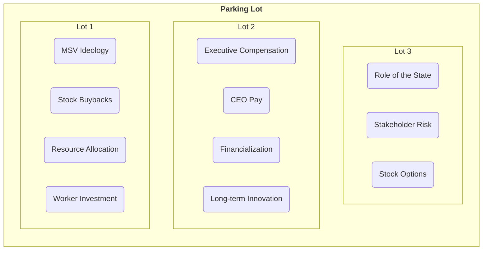
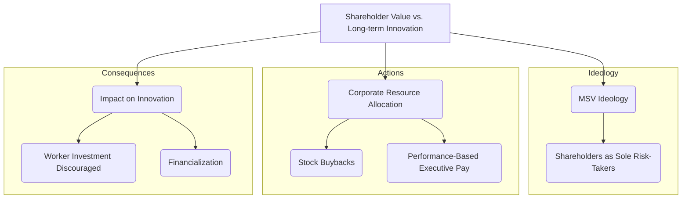
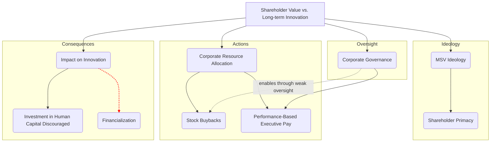

# Workshop: Part II

**From Question to Map** 🗺️

Now that you've analyzed the video and drafted a conceptual focus question, it's time to build the map. This is a hands-on activity where we will collaboratively construct a map to answer a question like this one:

> *"How does the ideology of **'Maximizing Shareholder Value'** create a structural tension with a firm's ability to invest in long-term **'Innovation'**?"*

### **Step 1: Create the Concept "Parking Lot"**

First, let's get our raw materials in one place. A "parking lot" is where we brainstorm all the relevant concepts from the video. It's okay if the ideas are messy or overlapping—the goal is to capture everything first and bring order to it later.

### **Step 2: Build the Initial Draft**

Now, let's bring structure to that chaos. We'll create our first version of the map by building a hierarchy and refining our concepts.

Notice our parking lot has `Executive Compensation`, `CEO Pay`, and `Stock Options`. These are too granular. We can synthesize them into a single, more powerful concept like **`Performance-Based Executive Pay`**. This process of refining and consolidating is a key skill.

**V1.0: Initial Draft (Post-Video)**

### **Step 3: Find the "Aha\!" Moments with Cross-Links**

With the basic structure in place, we now look for the deeper connections **between** the branches. These cross-links are where the most powerful insights are found. For example, how does an "Action" affect a "Consequence"?

A cross-link from `Stock Buybacks` to `Worker Investment Discouraged` with the linking phrase **"diverts funds from"** creates a powerful analytical point for your paper:

> *"The analysis shows that corporate actions, such as **stock buybacks**, are not neutral financial decisions; they actively divert funds that could have been used for **worker investment**, thereby weakening the firm's innovative capacity."*

-----

### **Step 4: Evolve the Map (The Living Document)**

This V1.0 map is an excellent summary of the video. But a concept map is a **living document** that should evolve as your understanding deepens. As you learn more in the course, you can revisit your map to:

  * **Up-level Your Language:** Swap a simple concept for a more precise, contemporary term.
  * **Add Nuance:** Break down a broad concept into more specific parts.
  * **Expand the Scope:** Introduce new concepts that add another dimension to your analysis.

Let's see what this map might look like a few weeks later, after you've learned about Corporate Governance.

**V2.0: Evolved Map (After a Few Weeks)**

#### **What's Changed and Why?**

  * **Conceptual "Up-leveling":** `Worker Investment` became **`Investment in Human Capital`**. This reflects a more contemporary and sophiticated understanding of the concept.
  * **Added Nuance:** `Shareholders as Sole Risk-Takers` was refined to the more precise term **`Shareholder Primacy`**, the formal name for this ideology.
  * **Expanded Scope:** We've added a new branch for **`Corporate Governance`**. This shows a deeper understanding that the *actions* of a corporation are directly influenced by its *oversight structures*.
  * **A More Powerful Cross-Link:** The new cross-link from `Corporate Governance` to `Stock Buybacks` ("enables through weak oversight") provides a more specific and insightful causal argument.